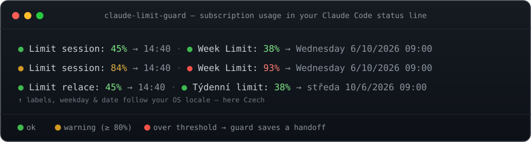

# claude-limit-guard

> Never get cut off mid-task again. **claude-limit-guard** watches your Claude subscription
> usage, shows it in the status line, injects it into context, and — at a threshold you
> choose — gracefully saves a handoff so work resumes cleanly after the limit resets.

[](https://github.com/funhunter7/claude-limit-guard/actions/workflows/ci.yml)
[](LICENSE)


<p align="center">
  
</p>
<p align="center">
  
</p>

```text
🟢 Limit session: 72% → 06:00 · 🟢 Week Limit: 39% → Wednesday 6/3/2026 10:00
```

A colored dot per window (🟢 ok · 🟡 warning · 🔴 over threshold), the live percentage, and
when it resets — a same-day reset shows just the time, a later one adds the weekday and date.

---

## Contents

- [Features](#features)
- [Requirements](#requirements)
- [Install](#install)
- [Commands](#commands)
- [Configuration](#configuration)
- [How it works](#how-it-works)
- [Troubleshooting](#troubleshooting)

## Features

- 📊 **Live status line** — usage % and reset time for the 5-hour and 7-day windows, color-banded.
- 🌍 **Follows your system** — weekday/date names, message language, time format, and glyph
  style auto-detect from the OS/terminal (Windows & Linux). No language to configure.
- 🛟 **Graceful guard** — at your threshold the Stop hook blocks once and runs a save/handoff
  routine (or your own action) so nothing is lost; the SessionStart hook offers to resume.
- 🧭 **Both windows guarded** — the 5-hour *and* the 7-day limit trip the guard.
- ⚙️ **Menu-driven config** — `/limit-guard-config` and `/limit-guard-action` let you pick
  settings from lists instead of hand-editing JSON.
- 🔌 **No network on keystrokes** — reads native `rate_limits` from stdin; falls back to the
  OAuth usage endpoint only when needed, behind a warm cache.

## Requirements

- Node.js ≥ 18 on `PATH`
- A logged-in Claude Code (reads `~/.claude/.credentials.json`)

## Install

### From the marketplace (recommended)

In Claude Code, add this repository as a marketplace and install the plugin:

```text
/plugin marketplace add funhunter7/claude-limit-guard
/plugin install claude-limit-guard@claude-limit-guard
```

(`funhunter7/claude-limit-guard` is the GitHub `owner/repo`; `claude-limit-guard@claude-limit-guard`
is `plugin@marketplace`.) This auto-registers the hooks, the `/limit-guard-config` and
`/limit-guard-action` commands, and the `/config` options. Pull updates later with:

```text
/plugin marketplace update claude-limit-guard
/plugin update claude-limit-guard
```

### Local development

```bash
claude --plugin-dir /path/to/claude-limit-guard
```

### Status line (manual)

The status line is a user setting, so add it to `~/.claude/settings.json` yourself:

```json
{
  "statusLine": {
    "type": "command",
    "command": "node \"%LOCALAPPDATA%\\path\\to\\claude-limit-guard\\bin\\usage.mjs\" --statusline",
    "refreshInterval": 30
  }
}
```

Use the absolute path to `bin/usage.mjs`. On macOS/Linux use a normal POSIX path.

## Commands

| Command | What it does |
|---------|--------------|
| **`/limit-guard-config`** | Pick a setting (`threshold`, `warn_band`, per-window thresholds, `watch`, `label_style`, `reset_display`, `projection_display`, `time_format`, `style`) from menus, choose **global** or **current-project** scope, and set its value — no JSON editing. |
| **`/limit-guard-action`** | Set or clear the **guard action** (at the threshold) or the **warn action** (in the warn band), globally or per-project. |
| **`/limit-guard-status`** | Print the resolved config plus a health snapshot — token, status-line cache age, whether the status line is wired, and burn-rate history readings. |
| **`/limit-guard-stats`** | Summarize recent usage from the rolling ~7-day log: number of readings, peak 5h/7d utilization, and reset count. |

Both write through a validated helper that preserves your other settings.

## Configuration

Settings you can change **directly in Claude Code** via `/config` (under this plugin's options):

| Option | Type | Default | Effect |
|--------|------|---------|--------|
| `threshold` | number | `95` | At or above this usage percentage the guard routine triggers. |
| `warn_band` | number | `80` | At or above this percentage (but below `threshold`) the status line turns amber. |
| `threshold_five_hour` | number | _(unset)_ | Per-window guard threshold for the `five_hour` window; overrides `threshold` for it. Blank = use the global `threshold`. |
| `threshold_seven_day` | number | _(unset)_ | Per-window guard threshold for the `seven_day` window; overrides `threshold` for it. Blank = use the global `threshold`. |
| `watch` | string (CSV) | `five_hour,seven_day` | Which limit windows to show/guard, comma-separated. Also accepts the (best-effort, when present) per-model windows `seven_day_opus` / `seven_day_sonnet`. |
| `guard_action` | string | `""` | What Claude should do when the threshold is reached. Leave empty for the built-in save-and-handoff routine. |
| `warn_action` | string | `""` | Gentle, **non-blocking** advice appended to context while usage is in the warn band (below `threshold`). Leave empty for the built-in message. |
| `label_style` | enum | `full` | Window labels: `full` (`Limit session:` / `Week Limit:`) or `short` (`5h` / `7d`) to save line width. |
| `reset_display` | enum | `clock` | Reset time as `clock` (`→ 06:00`), `relative` (`→ in 2h13m`), or `both` (`→ 06:00 (in 2h13m)`). |
| `projection_display` | enum | `off` | When `on`, adds a burn-rate estimate like `📈 ~1h40m to 90%` for the soonest-to-breach window, from the recent usage trend. |
| `notifications` | enum | `off` | When `on`, pops up an OS notification once when a window enters the warn band or crosses the threshold (macOS/Linux/Windows, best-effort). |

### Auto-detected (not in the `/config` dialog)

These follow your environment, so `/config` doesn't prompt for them. Override on demand via
`/limit-guard-config` or JSON:

| Option | Default | Effect |
|--------|---------|--------|
| `locale` | `system` | Language for the weekday/date and messages — follows the **OS locale** (Windows & Linux), so you needn't set a language. Override with a BCP-47 tag like `cs-CZ`, `de-DE`, `ja-JP`. |
| `time_format` | `system` | Reset time format: `system` (follow OS), `12` (`→ 5:00 PM`), or `24` (`→ 17:00`). |
| `style` | `auto` | Status-line glyphs: `auto` (detect terminal), `emoji`, or `ascii` (safe for legacy cmd/conhost). |

### Setting values

- **`/config`** — pick the plugin and edit the values interactively (easiest).
- **`/limit-guard-config`** — choose values from menus, global or per-project.
- **`~/.claude/settings.json`** — set them under `pluginConfigs` by hand:
  ```json
  {
    "pluginConfigs": {
      "claude-limit-guard@claude-limit-guard": {
        "threshold": 90,
        "guard_action": "Save a handoff to RESUME.md and stop."
      }
    }
  }
  ```
  Claude Code passes these to the plugin as `CLAUDE_PLUGIN_OPTION_<KEY>` env vars.

### Per-project override

Drop `.claude/limit-guard.json` and `.claude/limit-guard.md` (copy from `templates/`) into a
project to override these settings for that project only.

### Precedence (most specific wins)

| Priority | Source |
|----------|--------|
| 1 (highest) | Per-project `.claude/limit-guard.json` |
| 2 | `/config` option for hooks/commands (`CLAUDE_PLUGIN_OPTION_*`, injected by Claude Code) |
| 3 | `/config` option read from `settings.json` `pluginConfigs` (covers the status line) |
| 4 (lowest) | Built-in default |

> The status line is a plain user setting, so Claude Code does not inject the option env vars
> for it. The plugin therefore reads your `/config` options straight from `settings.json`, so
> they apply to the status line too — not only to the hooks.

## How it works

- **Status line** — `🟢 Limit session: 72% → 06:00 · 🟢 Week Limit: 39% → Wednesday 6/3/2026 10:00`
  (emoji = band, % always shown). Labels follow the OS locale — Czech shows `Limit relace:` /
  `Týdenní limit:`. A same-day reset shows just the time (`→ 06:00`); a reset on another day
  adds the full weekday and a date so the 7-day window is unambiguous. The date follows the OS
  locale's field order with slashes and a year — US `6/3/2026` (month first), Europe `3/6/2026`
  (day first).
- **UserPromptSubmit / Stop hooks** — inject the live limit; at/above the threshold they
  instruct Claude to run the guard routine. The Stop hook blocks once per reset window (so it
  never loops) and covers both the 5-hour and 7-day windows.
- **SessionStart hook** — offers to resume from the handoff file after a reset.
- **Rendering & fallback** — on a legacy Windows console (cmd/conhost) where colored emoji
  don't render, `style: auto` falls back to ASCII (`[OK] Limit session: 72% -> 06:00 | ...`).
  A missing/expired token shows `🔑 sign in`.

The status line reads rate-limit usage from the native `rate_limits` data Claude Code passes
on stdin (Pro/Max, after the first API response), so the per-keystroke path makes no network
call. It falls back to `GET https://api.anthropic.com/api/oauth/usage` (your local OAuth token
— the same source as `/usage`) when that data is unavailable (API-key sessions, before the
first response, older Claude Code). Hooks always call `getUsage()`, which reads the same ~45s
cache the status line keeps warm — so they hit the OAuth endpoint only when that cache is cold.

## Troubleshooting

The status line and hooks stay silent on failure (so a network blip never breaks your prompt).
Two environment variables help when the reading looks wrong:

| Env var | Effect |
|---------|--------|
| `CLAUDE_LIMIT_GUARD_DEBUG=1` | Print fetch/cache/auth decisions to **stderr** (`[limit-guard] …`). Set anything other than ``/`0`/`false`/`no` to enable. |
| `CLAUDE_LIMIT_GUARD_CC_VERSION` | Override the `claude-code/<version>` User-Agent sent to the usage endpoint, in case a pinned version is ever rejected. |

## Development

```bash
npm test          # node --test (193 tests)
npm run lint      # eslint .
npm run check     # lint + test
```

Tests pin `TZ=Europe/Prague` for deterministic wall-clock formatting; CI runs them on Node
18/20/22 and lints on Node 22.

## License

[MIT](LICENSE)
